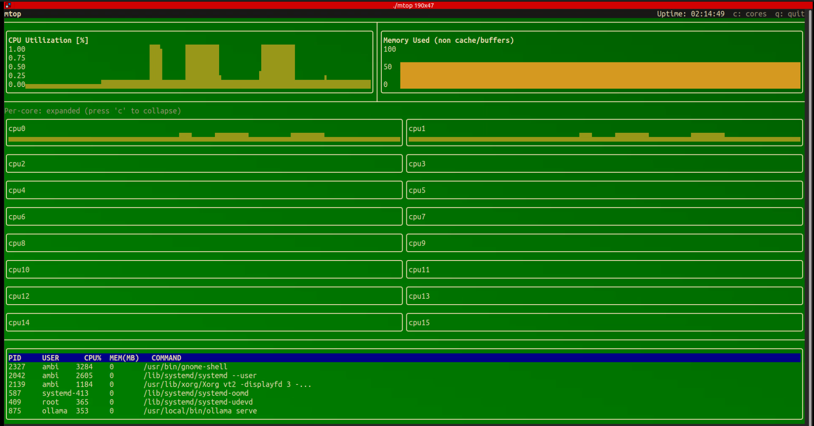

# mtop: a minimal terminal monitor

mtop (“my top”) is a terminal UI inspired by htop. I built it while exploring terminal UIs and Linux proc files parsing.

## What it does

- **CPU**: total and per core utilization using delta sampling
- **Memory**: usage excluding cache/buffers
- **Processes**: basic list with PID, user, CPU%, MEM, and command
- **UI**: implemented with FTXUI

> Note: I was focusing more on the Linux parser and understanding how terminal UI's are built, so donot use it for your serious projects.

## How

I studied htop’s approach to:
- Compute CPU and memory utilization from `/proc/stat` and `/proc/meminfo`
- Read per process stats from `/proc/[pid]/*`

Then reimplemented the logic with C++ interface and an FTXUI front end.

## Build and run

Requirements:
- Linux
- C++17
- make
- FTXUI

Steps:
```bash
git clone <this repo>
cd mtop
make build
cd build
./mtop
```

## Keys

- `c` — toggle per core view
- `q` — quit

## Possible upgrades

- [x] Linux parser for CPU/memory/proc stats
- [x] Basic process table
- [ ] Instantaneous per process CPU (delta-based)
- [ ] Sorting/filtering
- [ ] Configurable refresh rate
- [ ] More cool widgets 

## Acknowledgments

- Inspired by the design and internals of `htop`
- UI built with [FTXUI](https://github.com/ArthurSonzogni/FTXUI)